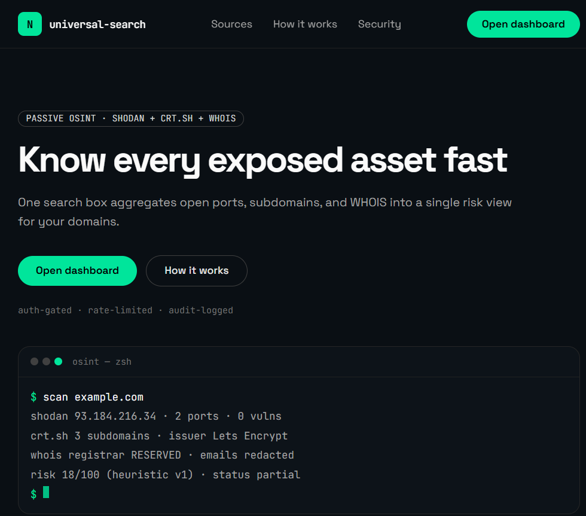

# Network Universal Search Agent

Secure passive OSINT dashboard (Next.js 15 + FastAPI). One search box → Shodan ports, crt.sh subdomains, WHOIS + transparent risk heuristic, session-gated and rate-limited.



- **Status:** v1 implemented. Open items → [TODO.md](./TODO.md).
- **Docs map:** setup/commands → [WORKFLOW.md](./WORKFLOW.md) · system design → [ARCHITECTURE.md](./ARCHITECTURE.md) · requirements → [PRD.md](./PRD.md) · UI tokens → [DESIGN.md](./DESIGN.md) · contribution rules → [AGENTS.md](./AGENTS.md) · history → [CHANGELOG.md](./CHANGELOG.md).

## Features

- Aggregated scan: open ports, services, CVEs (NVD cross-checked tiers), subdomains, WHOIS
- Partial failure is first-class: one dead source never 500s the scan — per-source error badges
- Better Auth sessions (email/password + optional Google/GitHub), per-user rate limit, immutable scan history
- Dark-first UI, reduced-motion aware, Chart.js dashboards

## Quickstart

Prereqs: Node 20.6+ · Python 3.11+ · Docker · Git — per-OS install commands in [WORKFLOW.md §1](./WORKFLOW.md#1-prerequisites).
Free Shodan key: https://account.shodan.io/

```powershell
# 1. env + database (use `cp` on macOS/Linux)
Copy-Item frontend\.env.local.example frontend\.env.local
Copy-Item backend\.env.example backend\.env   # fill SHODAN_API_KEY + BETTER_AUTH_SECRET (32+)
# POSTGRES_PASSWORD has no default in docker-compose.yml — set it before Compose starts:
$env:POSTGRES_PASSWORD = "pick-any-local-password"
docker compose up -d postgres   # use the same password in both DATABASE_URL values

# 2. backend (terminal 1)
cd backend
python -m venv .venv
.\.venv\Scripts\Activate.ps1
pip install -r requirements-dev.txt
alembic upgrade head
uvicorn app.main:app --reload --port 8000

# 3. frontend (terminal 2)
cd frontend
npm install
npm run auth:migrate
npm run dev
```

Windows one-liner: `.\dev.ps1` (starts both, reclaims ports, opens the sign-up page).
Full env reference, OAuth setup, test commands, and troubleshooting → [WORKFLOW.md](./WORKFLOW.md).

## Verify it works

Sign up at `/sign-in` → scan `example.com`. Expected: per-card skeletons → results, history saves automatically. Without a valid `SHODAN_API_KEY` the scan still lands as `partial` with an error badge on the Shodan card (crt.sh + WHOIS render) — designed behavior, not a bug.

Browser only calls `/api/*` (Next proxy → FastAPI). Never call Shodan/crt.sh from the browser, never call `:8000` directly.

## Troubleshooting

See [WORKFLOW.md §7](./WORKFLOW.md#7-troubleshooting) — session redirects, 401/502/503, OAuth, private-target rejection, and the OneDrive `.next EINVAL` quirk.

## Project structure

```
frontend/app/
  page.tsx                        # public landing (dark-lock #0a0f14)
  _components/landing/            # Nav, Hero, TerminalTyper, ambient/motion layer
  (dashboard)/dashboard/          # TargetSearch, tables, cards, charts (ssr:false)
  api/scan/[[...path]]/route.ts   # session proxy → FastAPI
  api/auth/[...all]/route.ts      # Better Auth endpoints
backend/app/
  routers/{scan,history,health}.py
  services/orchestrator.py + {shodan,crtsh,whois,nvd,risk}_service.py
  core/{config,security,rate_limit,logging,cache}.py
```

## Checks (run before every PR)

```bash
# frontend/                          # backend/
npm run lint                         # pytest -q
npm run tsc                          # ruff check .
npm test                             # black --check .
```

Run the checks above locally before every PR. (`.github/` is intentionally git-ignored — the CI workflow exists locally but is not shipped.)

## Production checklist

Rotate: `SHODAN_API_KEY`, `BETTER_AUTH_SECRET`, `DATABASE_URL`. Set `CACHE_BACKEND=postgres` on hosts without a persistent volume, and exact `CORS_ORIGINS`. External actions (production OAuth callbacks, dependency license review) → [TODO.md](./TODO.md). License: [MIT](./LICENSE).
